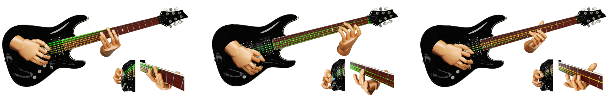

# Synchronize Dual Hands for Physics-Based Dexterous Guitar Playing

This is the official implementation for _*Synchronize Dual Hands for Physics-Based Dexterous Guitar Playing*_. [[Webpage](https://pei-xu.github.io/guitar)] [[arXiv](#)] [[Youtube](https://www.youtube.com/watch?v=r_y0P2pIeF8&list=PLLfEynalFz6j0X5Kiut0U3GLRxt3Oz_oa)] [SIGGRAPH Asia'24]

This implementation is based on 

- _*AdaptNet: Policy Adaptation for Physics-Based Character Control*_ 
[[arXiv](http://arxiv.org/abs/2310.00239)]
[[Youtube](https://youtu.be/WxmJSCNFb28)]
[[webpage](https://pei-xu.github.io/AdaptNet)]

- _*Composite Motion Learning with Task Control*_ 
[[arXiv](https://arxiv.org/abs/2305.03286)]
[[Youtube](https://youtu.be/mcRAxwoTh3E)]
[[webpage](https://pei-xu.github.io/CompositeMotion)]

- _*A GAN-Like Approach for Physics-Based Imitation Learning and Interactive Character Control*_
[[arXiv](https://arxiv.org/abs/2105.10066)]
[[Youtube](https://www.youtube.com/watch?v=VHMyvDD3B_o)]
[[webpage](https://pei-xu.github.io/ICCGAN)]

## Citation
If you use the code or provided motions for your work, please consider citing our papers:

    @article{guitar,
        author = {Xu, Pei and Wang, Ruocheng},
        title = {Synchronize Dual Hands for Physics-Based Dexterous Guitar Playing},
        booktitle = {SIGGRAPH Asia 2024 Conference Papers (SA Conference Papers '24)},
        publisher = {Association for Computing Machinery},
        address = {New York, NY, USA},
        year = {2024},
        doi = {10.1145/3680528.3687692}
    }

We also refer to our work for piano playing _*FürElise: Capturing and Physically Synthesizing Hand Motions of Piano Performance*_ [SIGGRAPH Asia'24].

## Mocap Data
We provide the guitar-playing data that we captured from a professional guitarist.
The mocap data were collected under the support from [NOKOV](https://www.nokov.com/).
The dataset includes various motions of guitar-playing techniques (see [data/README.md](data) for details).
In this project, however, we use only two short clips for policy training (see `assets/motions`).

## Code Usage

### Dependencies
- Pytorch 2.1
- Isaacgym Pr4

We recommend to install all the requirements through Conda by

    $ conda create --name <env> --file requirements.txt -c pytorch -c conda-forge -c nvidia

IsaacGym Pr4 is available from the [official site](https://developer.nvidia.com/isaac-gym) and can be installed through `pip`.

### Policy Training
We adopt a two-phase training strategy to obtain a bimanual control policy by adapting two single-hand policies.
To train single-hand policies, please run

    # left-hand policy
    $ python main.py cfg/left_demo.py --note <music_note_file> --ckpt <checkpoint_dir>
    
    # right-hand policy
    $ python main.py cfg/right.py --ckpt <checkpoint_dir>

For the right-hand policy, we perform training using randomly generated string playing patterns, and, therefore, do not need to specify the music note file.
For the left-hand policy, we provide some guitar tabs in `assets/notes`, which can be used to train a policy for a specific song.
We do not provide the music track collection that were used for the left hand policy training, as described in the paper, due to copyright reasons.
A policy supporting mutiple music tracks can be obtained by putting multiple music tracks into one note file for training.

To train two-hand policies, pleas run

    $ python main.py cfg/two_demo.py --note <music_note_file> \
        --left <checkpoint_dir_or_file_of_the_pretrained_left_hand_policy_> \
        --right <checkpoint_dir_or_file_of_the_pretrained_right_hand_policy> \
        --ckpt <checkpoint_dir>

### Evaluation

    # left-hand policy
    $ python main.py cfg/left_demo.py> --note <music_note_file> --ckpt <checkpoint_dir_or_file> --test
    
    # right-hand policy
    $ python main.py cfg/right.py --note <music_note_file> --ckpt <checkpoint_dir_or_file> --test

    # two-hand policy
    $ python main.py cfg/two_demo.py --note <music_note_file> --ckpt <checkpoint_dir_or_file> --test

We provide pre-trained bimanual control policies in `models` folder and the demo music notes in `assets/notes`.
We also provide the pre-trained right-hand plicy in `models` folder.

Please visit our [webpage](https://pei-xu.github.io/guitar) for animated results of the pre-trained models.
