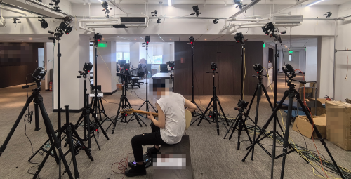
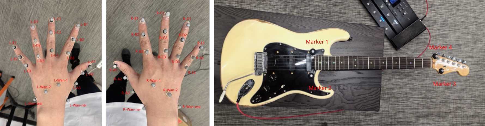

# Guitar Playing Motion Dataset

This dataset can be used under the Creative Commons Attribution-NonCommercial-NoDerivatives 4.0 International Public License.

Diverse guitar-playing motions about 1 hour long, including:

- 12 major scales,
- chromatic scales,
- diverse chords,
- arpeggios,
- strumming and picking,
- bends,
- sliding,
- vibrato,
- palm mute,
- natural harmonics,
- artificial harmonics,
- hammer-ons and pull-offs.

All data were collected from a professional guitarist, and are general guitar-playing motions instead of the recording of playing any specific songs.
All notes were played as 1/8th and mostly at 100BPM. 
The instrument is a [Fender American Deluxe Stratocaster](doc/guitar.pdf)  guitar with 6 strings and 22 frets. The scale length is 25.5 inches.

We deployed 18 infrared cameras for motion capture, 7 of which have a resolution of 9MP and 11 have a resolution of 4MP. All cameras are the products from [NOKOV](https://www.nokov.com/). 

We thank [NOKOV](https://www.nokov.com/) for their supporting of motion capture solutions, Hao Wang, the subject guitarist, for his performance, and Mengyao Zhang and Dr. Hongming Fan for helping in organizing motion capture. 

If you use this dataset, please consider citing the paper:

    @article{adaptnet,
        author = {Xu, Pei and Wang, Ruocheng},
        title = {Synchronize Dual Hands for Physics-Based Dexterous Guitar Playing},
        booktitle = {SIGGRAPH Asia 2024 Conference Papers (SA Conference Papers '24)},
        publisher = {Association for Computing Machinery},
        address = {New York, NY, USA},
        year = {2024},
        doi = {10.1145/3680528.3687692}
    }

## Papers using This Dataset

- [Synchronize Dual Hands for Physics-Based Dexterous Guitar Playing](https://pei-xu.github.io/guitar)

If you use this dataset, please contact me to add your work in this list.

## Data Format

All data items are provided in CSV format with markers defined as the following picture.

For each marker, we provide its 3D position in XYZ order.
Note that due to occlusion, some marker positions are not available to reconstruct in some cases. For those markers, we use `nan` in the CSV files to represent their positions.
